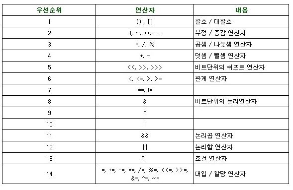

목표
=======
자바가 제공하는 다양한 연산자를 학습하세요.

학습할 것
=======
- 산술 연산자
- 비트 연산자
- 관계 연산자
- 논리 연산자
- instanceof
- assignment(=) operator
- 화살표(->) 연산자
- 3항 연산자
- 연산자 우선 순위
- (optional) Java 13. switch 연산자

--------------------------------------------------------------
week3: 연산자
=======

## 1. 산술 연산자
boolean타입을 제외한 모든 기본 타입에 사용할 수 있다.
|연산식|설명|
|:---:|:---|
| 피연산자 `+` 피연산자 | 덧셈 연산 |
| 피연산자 `-` 피연산자 | 뺄셈 연산 |
| 피연산자 `*` 피연산자 | 곱셈 연산 |
| 피연산자 `/` 피연산자 | 좌측 피연산자를 우측 피연산자로 나눔, 몫을 구하는 연산 |
| 피연산자 `%` 피연산자 | 좌측 피연산자를 우측 피연산자로 나눈 나머지를 구는 연산 |
   
## 2. 비트 연산자
비트 연산자는 특정 비트를 사용하기 위해 꺼내 올때 사용하고, 다음과 같은 연산자들을 가지고 있다.
| 연산자 | 설명 | 연산 예 |
|:---:|:---|:---:|
| `~`|비트의 반전(1의 보수)|a= ~a;|
|`&`|비트 단위 AND| `1&1`은 1반환, 그 외는 `0 반환` |
|`ㅣ`|비트 단위 OR|`0ㅣ0`은 9반환, 그 외는 `1 반환`|
|`^`|비트 단위 XOR|두개의 비트가 `서로 다른 경우`에만 `1 반환`|
|`<<`|왼쪽 shift| `a<<2` , 변수a를 2비트만큼 왼쪽으로 이동|
|`>>`|오른쪽 shift|`a>>2` , 변수a를 2비트만큼 오른쪽으로 이동|
|`>>>`|오른쪽 shift|>> 동일한 연산, 채워지는 비트가  `부호와 상관없이 0으로 채워짐`|
   
## 3. 관계 연산자
비교 연산자라고도 하며, 관계연산자의 결과는 true 혹은 false 값인 boolean자료형으로 반환된다.
| 연산자 | 기능 | 연산 예 |
|:---:|:---|:---:|
| > | 왼쪽 항이 크면 참, 아니면 거짓 반환 | num > 7; |
| < | 왼쪽 항이 작으면 참, 아니면 거짓 반환 | num < 7; |
| >= | 왼쪽 항이 오른쪽 항보다 크거나 같으면 참, 아니면 거짓 반환 | num >= 7; |
| <= | 왼쪽 항이 오른쪽 항보다 작거나 같으면 참, 아니면 거짓 반환 | num <= 7; |
| == | 두 개의 값이 같으면 참, 아니면 거짓을 반환 | num == 7; |
| != |  두 개 항이 다르면 참, 아니면 거짓 반환 | num != 7; |
   
## 4. 논리 연산자
| 연산자 | 기능 |
|:---:|:---|
| `&&` (논리 곱) | 두 항이 모두 참인 경우에만 결과 값이 참.그렇지 않은 경우는 거짓 |
| `ㅣㅣ`(논리 합)| 두 항 중 하나의 항만 참이면 결과 값은 참. 두항이 모두 거짓이면 거짓 |
| `!` (부정)|단항 연산자이다. 참인 경우는 거짓으로, 거짓인 경우 참으로 변경 됨 |
   
## 5. instanceof
객체타입을 확인하는데 사용한다. 속성은 연산자이고, 형변환이 가능한지 해당 여부를 boolean타입(true/false)로 리턴한다. 주로 부모 객체인지 자식 객체인지 확인하는데 쓴다고 생각하면 된다.
```java
class A{}
class B extends A{}

class instanceTest{
	public static void main(String[] args){
		A a = new A();
		B b = new B();
		
		System.out.print(a instanceof A);	//true
		System.out.print(b instanceof A);	//true
		System.out.print(a instanceof B);	//false
		System.out.print(b instanceof B);	//true
	}
}
```
   
## 6. assignment(=) operator
대입 연산자라고도 하며, 변수에 값을 `대입`할 때 사용하는 이항 연산자이다.
결합 방향은 왼쪽<- 오른쪽 이다.
```java
res += 10;      // res = res+10; 와 같다. 
res -= 10;      // res = res-10; 와 같다. 
res *= 10;      // res = res*10; 와 같다. 
res /= 10;      // res = res/10; 와 같다. 
res %= 10;      // res = res/10 의 나머지와 같다.
```
   
## 7. 화살표(->) 연산자
#### 람다 표현식(lambda expression)이란 
간단히 말해 메소드를 하나의 식으로 표현한 것이다.
람다 표현식으로 표현하면, 클래스를 작성하고 객체를 생성하지 않아도 메서드를 사용할 수 있다.
```java
// 메서드
int min(int x, int y){
    return x<y ? x : y;
}
// 람다 표현식
(x,y)-> x<y ? x : y;
```
   
그런데 자바에서는 클래스의 선언과 동시에 객체를 생성하므로, 단 하나의 객체만을 생성할 수 있는 클래스를 익명 클래스라고 한다.    
따라서 자바에서 람다 표현식은 익명 클래스와 같다고 할 수 있다.
```java
// 람다 표현식
(x,y)-> x<y ? x : y;

//익명 클래스
new Object() {
    int min(int x, int y) {
        return x < y ? x : y;
    }
}
```
이러한 람다 표현식은 메서드의 매개변수로 전달될 수 있으며, 메서드의 결과값으로 반환 될 수 수도있다.    
따라서 람다 표현식을 사용하면, 기존의 불필요한 코드를 줄여주고, 작성된 코드의 가독성을 높여준다.
   
## 8. 3항 연산자
유일하게 세 개의 항으로 만들어져 있는 연산자이다.   
조건항 ? 항1 : 항2 의 구조로 사용되는데 조건항이 참일 경우 항1의 값을 반환하고, 조건항이 거짓일 경우 항2의 값을 반환한다.
```
(조건) ? TRUE : FALSE
```
   
## 9. 연산자 우선 순위
</img><br/> 
   

## 10. (optional) Java 13. switch 연산자
Java12부터 switch 연산자가 추가 되었다.
기존에 switch문이 변경된것이 아니라 switch 연산자가 추가 된것이다.
   
#### switch statement
- 다수의 case,break가 존재하게 된다.
- break; 를 빼먹을 경우 다음 분기로 넘어가게 됨.
- return값이 존재할수없다.

#### switch operator
- break를 사용하지 않아도 된다.
- yield 존재함
- return값 존재해도됨
- case -> A 같은 형식으로 표현가능
- switch의 반환값이 따로 필요하지 않거나 case가 switch 들어오는 모든 인자를 커버하는 경우
- default 항목을 넣어주지 않아도 되나 그렇지 않은 경우는 default -> code를 작성해야 한다.

#### Java12
- ->(화살표) 표현이 가능하고 data만 존재할 경우 return이 가능하다.
- -> 구문을 사용할 경우 break;를 적지 않아도 다음 case 구문으로 넘어가지 않는다.
- -> 표현 오른쪽은 꼭 단일 수행일 필요는 없다. 블록 {} 안에서의 작업도 가능하다.

#### Java13
- yield 예약어가 추가됨. yield x 하게 되면 x가 리턴됨.
- yield는 예약어이지만 변수명으로 사용가능하다. int yield = 3;

```java
public static void main(String[] args) {
    //Java 12 이전
    int num = 1;		// 정수값 저장
    int returnNum = 0;	// 결과 값
	        
    switch(num) {
        case 1:
            returnNum = 1;
            System.out.println("정수 값은 1입니다.");
            break;
         case 2:
            returnNum = 2;
            System.out.println("정수 값은 2입니다.");
            break;
        default:
            System.out.println("Unexpected value: " + num);
            break;
	        }
    System.out.println("[Java12 이전] returnNum : [ " + returnNum + " ]");

    //Java 12
    returnNum = switch(num){
        case 1 -> 1;
	    case 2 -> 2;
	    default -> throw new IllegalStateException("Unexpected value: " + num);
    };
    System.out.println("[Java12] returnNum : [ " + returnNum + " ]");


    //Java13
    returnNum = switch(num){
        case 1 : yield 1;
        case 2 : yield 2;
        default : throw new IllegalStateException("Unexpected value : " + num);
    };

    System.out.println("[Java13] returnNum : [ " + returnNum + " ]");
}
```
> 정수 값은 1입니다.   
> [Java12이전] returnNum : [ 1 ]   
> [Java12] returnNum : [ 1 ]   
> [Java13] returnNum : [ 1 ]   
