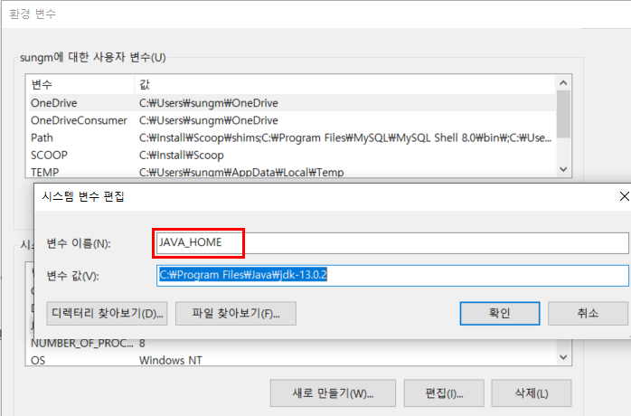
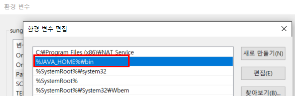

7주차 : 자바의 패키지에 대해 학습하세요.
=======

🎯 **목표** 
- package 키워드
- import 키워드
- 클래스패스
- CLASSPATH 환경변수
- -classpath 옵션
- 접근지시자
-------------------------------------------------------------- 
## 1. package 키워드
패키지는 비슷한 성격의 자바 클래스들을 모아 넣은 자바의 디렉토리이다.   
Class가 많아지고 한 폴더에 파일이 많아지면 관리가 어렵기 때문에, 관련된 파일들을 폴더 별로 나눠 관리하는 것이다.

**특징**   
- 한 폴더에는 같은 이름의 클래스가 여러 개 올 수 없음
- 내가 만든 package와 상대방이 만든 패키지가 같고, 그 안의 파일명도 같아면 함께 사용 불가
- 클래스를 만든 사람들은 고유의 패키지를 만들 필요가 있음
- 패키지명은 모두 lowercase로 작성함
> 보통 패키지는 도메인 이름을 반대로 쓴다.
> java.study.com => com.study.java

```java
package house.kim;

public class MinKim {
}
```
```java
package house.kim;

public class OakKim {
}
```
   
## 2. import 키워드
한 패키지에서 다른 패키지의 클래스를 접근하여 사용하려면 import키워드를 사용하여 포함시켜주어야한다.
또는, `*` 기호를 이용할 수도 있다.
```java
import house.kim.MinKim;
import house.kim.*;
```
   
## 3. 클래스패스
클래스패스란 JVM이 프로그램을 실행할 때, 클래스파일을 찾는 데 기준이 되는 파일 경로를 말한다.    
소스 코드(.java로 끝나는 파일)를 컴파일하면 소스 코드가 “바이트 코드”(바이너리 형태의 .class 파일)로 변환된다.    
java runtime(java 또는 jre)으로 이 .class 파일에 포함된 명령을 실행하려면, 먼저 이 파일을 찾을 수 있어야 한다.    
이때 .class 파일을 찾을 때 classpath에 지정된 경로를 사용한다.    
classpath는 .class 파일이 포함된 디렉토리와 파일을 콜론으로 구분한 목록이다.    
java runtime은 이 classpath에 지정된 경로를 모두 검색해서 특정 클래스에 대한 코드가 포함된 .class 파일을 찾는다.    
찾으려는 클래스 코드가 포함된 .class 파일을 찾으면 첫 번째로 찾은 파일을 사용한다.   

classpath를 지정할 수 있는 두 가지 방법이 있다. 
- CLASSPATH를 사용하는 방법
- java runtime에 -classpath 플래그를 사용하는 방법

## 4. CLASSPATH 환경변수
컴퓨터 시스템 변수 설정을 통해 지정할 수 있다.
JVM이 시작될 때 JVM의 클래스 로더는 이 환경 변수를 호출한다.
</img><br/> 

## 5. -classpath 옵션
컴파일러가 컴파일 하기 위해서 필요로 하는 참조할 클래스 파일을 찾기 위해서 컴파일시 경로를 지정해주는 옵션.
   
Hello.java파일이 `C:\Java` 디렉터리에 존재하고,   

필요한 클래스 파일들이 `C:\Java\Engclasses`에 위치한다면,   
`javac -classpath C:\Java\Engclasses C:\Java\Hello.java` 로 해주면 된다.

만약 참조할 클래스 파일들이 그 외의 다른 디렉터리, 그리고 현 디렉토리에도 존재한다면,   
`javac -classpath .;C:\Java\Engclasses;C:\Java\Korclasses C:\Java\Hello.java`   
과 같이; 으로 구분해줄 수 있다. ( . 은 현 디렉토리, .. 은 현 디렉토리에서 상위 디렉토리를 의미한다.)

또한 classpath 대신 단축어인 cp를 사용해도 된다.   
`javac -cp .;C:\Java\Engclasses;C:\Java\Korclasses C:\Java\Hello.java`

## 6. 접근지시자
- public : 아무런 제약없이 외부 접근 가능
- protected: 같은 패키지의 상속 관계 있는 객체까지만 접근 허용
- default : 해당 패키지 내에서만 접근 허용
- private : 해당 class 내에서만 접근 허용
    
**접근범위**
public > protected > default > private
