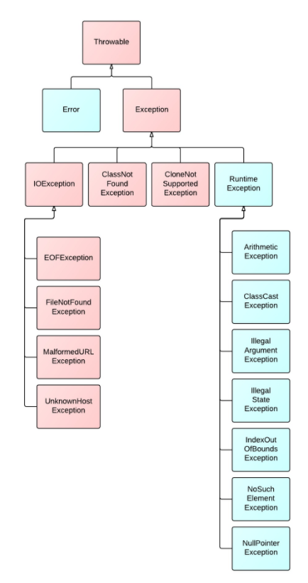

9주차 : 자바의 예외 처리에 대해 학습하세요.
=======

🎯 **목표** 
- 자바에서 예외 처리 방법 (try, catch, throw, throws, finally)
- 자바가 제공하는 예외 계층 구조
- Exception과 Error의 차이는?
- RuntimeException과 RE가 아닌 것의 차이는?
- 커스텀한 예외 만드는 방법
--------------------------------------------------------------
## 1. 자바에서 예외 처리 방법 (try, catch, throw, throws, finally)
### 예외 처리 코드
: 프로그램에서 예외가 발생했경우 프로그램의 갑작스러운 종류를 막고, 정상 실행을 유지할 수 있도록 처리하는 코드
- 컴파일러는 **"일반 예외"**가 발생할 가능성 존재 코드를 발견 -> 컴파일 오류를 발생 -> 예외 처리 코드를 작성하도록 요구(try-catch-finally블록 이용)
- **"실행예외"** 는 컴파일러가 체크해주지 않음 -> 개발자의 경험을 바탕으로 작성해야함
### try, catch, finally
```java
try { 
	/**
	* 문제가 없으면 try문 내 코드는 블록의 시작부터 끝까지 정상 실행된다. 
	* 경우에 따라 예외가 발생할 수 있다. 
	* 예외는 throw 문에 의해 직접적으로 발생 OR 예외를 발생시키는 메서드의 호출에 의해 발생할 수도 있다. 
	*/ 
} catch (e) { 
	/** 
	* try 블록에서 예외가 발생할 경우에만 실행된다. 
	* 이 문장들에선 지역 변수 e를 사용하여 Error 객체 또는 앞에서 던진 다른 값을 참조할 수 있다. 
	* 1) try문에서 발생한 예외를 처리할 수도 있고, 
	* 2) 아무것도 하지 않고 예외를 무시할 수도 있고, 
	* 3) throw 를 사용해서 예외를 다시 발생시킬 수도 있다. 
	*/ 
} finally { 
	/** 
	* 이 블록에는 try 블록에서 일어난 일에 관계없이, try문이 종료되면 무조건 실행된다.
	* try 블록이 종료되는 상황은 아래와 같다. 
	* 1) 정상적으로 블록의 끝에 도달했을 때 
	* 2) break, continue 또는 return 문에 의해서 
	* 3) 예외가 발생했지만 catch 절에서 처리했을 때 
	* 4) 예외가 발생했고 그것이 잡히지 않은 채 퍼져나갈 때 
	*/ 
}
```
### throw, throws
throw는 `Exception을 발생`시킬 때 사용하는 키워드.   
thorws는 메소드를 정의할 때 사용하며, 이 메소드에서 `발생할 수 있는 Exception을 명시적으로 정의할 때` 사용한다.   
따라서 throws를 보면 잠재적으로 어떤 Exception이 발생될 수 있는지 파악할 수 있다.

아래의 코드는 변수로 변경될수없는 문자열을 변환시도했기 때문에 NumberFormatException 발생한다.
이때 Integer.parseIntInt()코드를 보면, 예상 밖의 인자가 전달되었을 때 Exception을 throw하도록 구현되어있다.
```java
String numStr = "160a";
int num = Integer.parseInt(numStr);  //예외 발생
/*
Exception in thread "main" java.lang.NumberFormatException: For input string: "160a"
	at java.lang.NumberFormatException.forInputString(NumberFormatException.java:65)
	at java.lang.Integer.parseInt(Integer.java:580)
*/
```
```java
public static int parseInt(String s, int radix) throws NumberFormatException
{
    if (s == null) {
        throw new NumberFormatException("null");
    }
    if (radix < Character.MIN_RADIX) {
        throw new NumberFormatException("radix " + radix +
                " less than Character.MIN_RADIX");
    }
    ....
}
```

아래의 코드는 문제없이 string에서 int형으로 형변환 되지만, throw 키워드로 예외를 발생시켰기 때문에
콘솔창에서 다음과같은 메세지를 확인할 수 있다.
```java
String numStr = "160";
int num = Integer.parseInt(numStr);
throw new IllegalArgumentException("This string is not a number format"); //예외 발생
/*
Exception in thread "main" java.lang.IllegalArgumentException: 
	This string is not a number format
*/
```

## 2. 자바가 제공하는 예외 계층 구조
Java에서는 예외를 클래스로 관리한다.
JVM은 프로그램을 실행하는 도중에 예외가 발생하면, 해당 예외 클래스로 객체를 생성한다.    
그리고 나서 예외 처리 코드에서 예외 객체를 이용할 수 있도록 한다.
모든 예외 클래스들은 java.lang.Exception클래스를 상속받는다.


## 3. Exception과 Error의 차이는?
### Error
- 컴퓨터 하드웨어의 오동작 또는 고장으로 인해 응용프로그램 실행 오류가 발생하는 것

### Exception
- Error이외의 예외라고 부르는 오류
- 사용자의 잘못된 조작 또는 개발자의 잘못된 코딩으로 인해 발생하는 프로그램 오류
- 일반 예외, 실행 예외 두 종류가 존재
- **일반 예외/컴파일러 체크 예외(Exception)**
	: 자바 소스를 컴파일하는 과정에서 에외 처리 코드가 필요한지 검사한다. 예외 처리 코드가 없으면 컴파일 오류가 발생한다.
- **실행 예외(RuntimeException)**
	: 컴파일하는 과정에서 예외 처리 코드를 검사하지 않는 예외
	
## 4. RuntimeException과 RE가 아닌 것의 차이는?
일반예외는 Exception을 상속받지만, RuntimeException을 상속받지 않는 클래스들이다.
체크 예외가 발생할 수 있는 메소드를 사용할 경우, 복구가 가능한 예외들이기 때문에 반드시 예외 처리하는 코드를 작성해야한다.
catch문으로 예외를 잡거나, throws로 예외를 자신을 호출한 클래스로 던지는 방법으로 해결한다.
대표적인 Exception - IOException, SQLException

실행예외는 Exception과 RuntimeExcption을 상속받는 클래스들이다.
명시적으로 예외처리를 강제하지 않았기 때문에 언체크 예외라고 불린다.  
실행예외는 따로 catch문으로 예외를 잡거나, throws로 선언하지 않아도 된다. 
프로그램에 오류가 있을 때 발생하도록 의도된 것이다.
JVM은 RuntimeException을 상속했는지 여부를 보고 실행 예외를 판단한다.
대표적인 Exception - NullPointException, IllegalArgumentException

## 5. 커스텀한 예외 만드는 방법 
사용자 정의 예외 클래스 이름은 Exception으로 끝나는 것이 좋다.
생성자는 두개를 선언하는 것이 일반적인데, 하나는 매개변수가 없는 기본 생성자, 다른 하나는 예외 발생 원인(예외 메시지)을 전달하기 위해 String타입의 매개변수를 갖는 생성자이다.

아래 코드에서 Exception을 상속하면, 컴파일러에 의해 체크되는 예외가 필요하다.
```java
/* 사용자 정의 예외 클래스*/
public class xxxException extends [Exception|RuntimeException]{
	public xxxException(){}
	public xxxException(String message){
		super(message);
	}
}

/* 사용자 정의 예외 발생시키기*/
public void method() throws xxxException{
 throw new xxxException("메세지");
}
```
