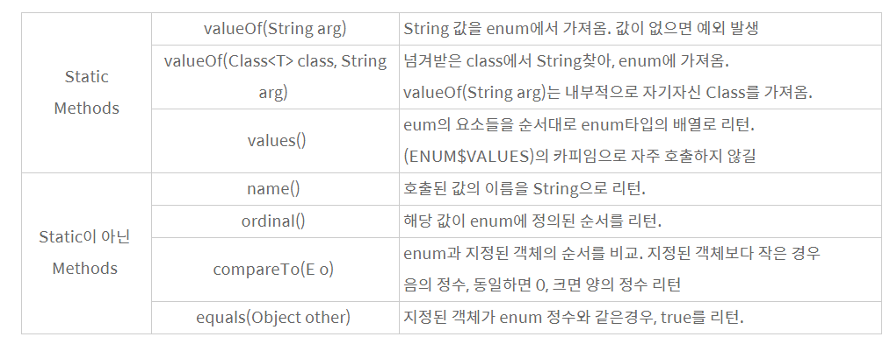

11주차 : 자바의 열거형에 대해 학습하세요.
=======

🎯 **목표** 
- enum 정의하는 방법
- enum이 제공하는 메소드 (values()와 valueOf())
- java.lang.Enum
- EnumSet
-------------------------------------------------------------- 
## 1. enum 정의하는 방법
### Enum을 이용한 열거형 선언하기
EnumClass는 다른 클래스와 마찬가지로 별도의 java파일, 클래스 안/밖에 선언 가능하다.
**특징**   
- 열거형으로 선언된 순서에 따라 0 부터 인덱스 값을 가진다.(순차적으로 증가)
- enum 열거형으로 지정된 상수들은 모두 대문자로 선언해야 한다.
- 마지막에 열거형 변수들을 선언한 후 세미콜론(;)은 찍지 않는다.
  (상수와 연관된 문자를 연결시킬 경우 세미콜론(;) 찍는다.)
   
```java
/* 별도의 .java선언 */
public enum Week {
	MONDAY,
	TUESDAY,
	WEDNESDAY,
	THURSDAY,
	FRIDAY,
	SATURDAY,
	SUNDAY
}
```
```java
/* 클래스 내부에 선언 */
public class Developer {
	public String name;
	public int career;
	
	public enum DevType{
		MOBILE,
		WEB,
		SERVER
	}
}
```
```java
/* 클래스 외부에 선언 */
public class Developer {
	public String name;
	public int career;
	public DevType type;
}

enum DevType{
	MOBILE,
	WEB,
	SERVER
}
```
    
## 2. enum이 제공하는 메소드 (values()와 valueOf())
**values()**    
: 열거된 모든 원소를 배열에 담아 순서대로 리턴     
**valueOf()**   
: 매개변수로 주어진 String과 열거형에서 일치하는 이름을 갖는 원소를 리턴    
일치하지 않는 경우 예외(IllegalArgumentException) 발생    


## 3. java.lang.Enum
열거체(enumeration type)로 JDK 1.5 이상에서 사용할 수 있다.
Enum 클래스는 모든 자바 열거체의 공통된 조상 클래스이다.   
Enum 클래스에는 열거체를 조작하기 위한 다양한 메소드가 포함되어 있다.
- 클래스처럼 보이게 하는 상수
- 서로 관련있는 상수들끼리 모아 상수들을 정의하는것
- enum 클래스 형을 기반으로 한 클래스형 선언


## 4. numSet
EnumSet은 enum 타입에 사용하기 위한 특수한 Set 구현이다.
EnumSet은 내부적으로 bit vector로 표현된다. 따라서 매우 효율적이다.
이 클래스를 구현할 때 공간/시간 퍼포먼스는 비트 플래그의 대안으로 사용할 수 있을 정도로 고수준이어야 한다.
