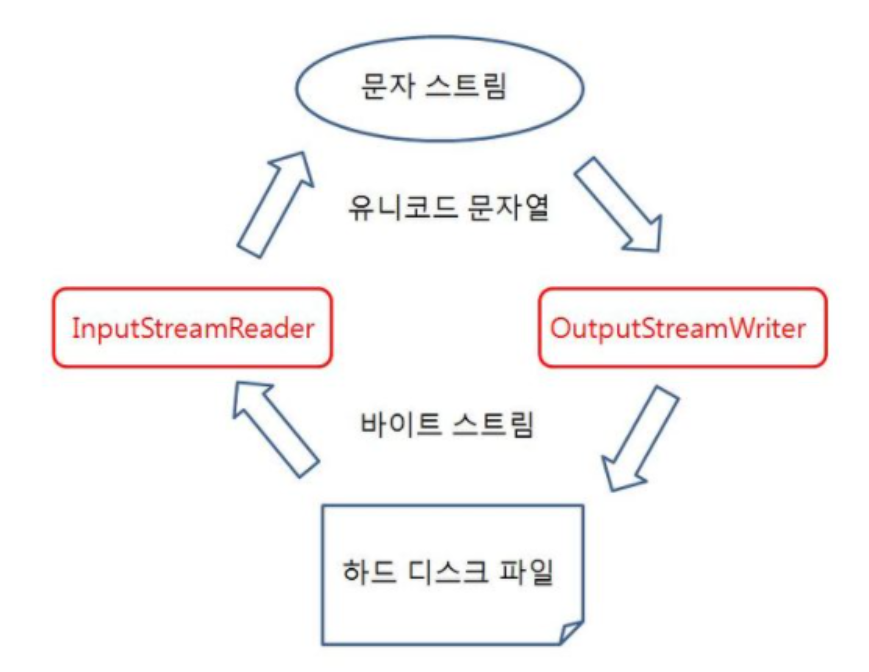
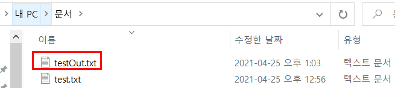

13주차 : 자바의 Input과 Ontput에 대해 학습하세요.
=======

🎯 **목표** 
- 스트림 (Stream) / 버퍼 (Buffer) / 채널 (Channel) 기반의 I/O
- InputStream과 OutputStream
- Byte와 Character 스트림
- 표준 스트림 (System.in, System.out, System.err)
- 파일 읽고 쓰기
-------------------------------------------------------------- 
### I/O란?
Input/Output으로 데이터를 입력/출력하는 것을 의미한다.   
예를 들어, 컴퓨터에 데이터를 전달하기 위해 키보드를 입력하는것을 input.   
입력된 데이터를 모니터 화면에 출력하여 보여주는것을 output이라고 할 수 있다.   
데이터는 어떤 방법으로 입력/출력(전달)할수 있는지에 대한 통로인 `Stream, Channel, Buffer`에 대해 알아보자.

## 1. 스트림 (Stream) / 버퍼 (Buffer) / 채널 (Channel) 기반의 I/O
### Stream
데이터가 들어온 순서대로 흘러다니는 `단방향`의 통로이다.   
입구와 출구가 존재하며 입구를 InputStream, 출구를 OutputStream이라고 한다.   
Stream을 통해 데이터는 기본적으로 byte또는 byte[]형태로 흘러다닌다.
Stream은 `동기적`,`blocking`방식으로 동작한다. 데이터를 읽거나 쓰기 위해 스트림에 요청하면 스트림은 자신의 역할에 맞춰 
다시 데이터를 읽거나 쓸 수 있을 때까지 다른 작업을 하지 못하고 무한정 기다린다.

Java에서 모든 기본 I/O는 Stream을 기반으로 하기 때문에 빈번하게 사용되는데,      
사용을 끝내고 닫아주지 않으면 심각한 메모리 누수가 발생할 수 있기 때문에 예외처리에 주의를 기울여서 사용해야 한다.

### Buffer
임시로 데이터를 담아둘 수 있는 일종의 **큐** 이다.   
byte단위의 데이터가 입력될 때마다 Stream은 즉시 전송하게 되는데,    
이는 디스크 접근이나 네트워크 접근같은 오버헤드가 발생하기 때문에 매우 비효율 적인 방법이다.   
Buffer는 중간에서 입력을 모아서 한번에 출력함으로써 I/O의 성능을 향상시키는 역할을 한다.
```java
public class SystemInExample {
	public static void main(String [] args) {
		long start, end;	// 프로그램의 시작,끝 시점의 시간 계산을 위한 변수
		
		start = System.currentTimeMillis();
		// nonBufferIO(); 
		// BufferIO();
		end = System.currentTimeMillis();
		//실행 시간 계산 및 출력
		System.out.println("\n실행 시간: " + (end-start)/1000.0 +"초");
	} 
	
	public static void nonBufferIO() {
		for (int i=0 ; i<1000; i++) {
			//입력이 있을 때마다 출력
			System.out.print(i+ " "); 
		}
	}
	
	public static void BufferIO() {
		StringBuffer sb = new StringBuffer();
	
		for (int i=0 ; i<1000; i++) {
			sb.append(i+" ");	//입력은 버퍼(sb)에 모두 담는다
		}
		System.out.print(sb);	// 버퍼 출력
	}
}
```
> **[nonBufferID() 실행결과]**   
> 0 1 2 3 4 5 6 7 8 9 ..(생략) 999   
> 실행 시간: 0.015초   

> **[BufferID() 실행결과]**   
> 0 1 2 3 4 5 6 7 8 9 ..(생략) 999   
> 실행 시간: 0.005초   

입력이 많아지고 데이터의 크기가 커질 수록 위와 같은 속도차이는 커질 것 이다.   
버퍼의 장점을 스트림에 적용해서 Java에서는 BufferedInputStream을 BufferedOutputStream을 제공한다.

### Channel
Java의 기본 입력방식이였던 Strea은 blocking방식과 Non-Buffer의 특징으로 인해 입출력 속도가 느릴 수 밖에 없었다.   
자바4부터 위와같은 문제를 해결하고자 NIO(New Input Output)가 java.nio패키지에 포함되어 등장했는데,
Channel이 그 NIO의 기본 입출력 방식이다.

Channel이란, 데이터가 흘러다니는 `양방향`의 통로이다.   
Channel은 Stream과 유사하지만 동작 방식이 다르다. 양방향이기 때문에 입력출력을 구분하지 않는다.Stream은 입력과 출력을 위해 
InputStream과 OutputStream을 만들어야했지만, Channel은 그럴 필요가 없다.

또한 Channel은 Stream과 다르게 기본적으로 Buffer를 통해서만 read,write를 할수있는 buffer방식이고,
blocking방식과 non-blocking 방식 모두 가능하다. NIO는 Non-blocking방식으로 데이터를 처리 할 수 있어서 과도한 스레드 생성을 피하고 스레드를 효과적으로 재사용할 수 있다.

**그렇다면, IO대신 무조건NIO가 좋은걸까?**   
아니다, 입출력 처리가 오래걸리는 작업일 경우, 스레드를 재사용하여 Non-blocking방식으로 처리하는    
NIO는 비효율 적이다. 또한 대용량 데이터 처리해야할 경우 NIO의 버퍼할당 크기가 문제가 되고, 
모든 입출력 작업에 버퍼를 무조건 사용해야 하므로 즉시 처리하는 IO보다 복잡하다

즉, NIO는 불특정 다수의 클라이언트를 연결하거나 하나의 입출력 처리작업이 오래걸리지 않을 경우에 사용.   
IO는 연결 클라이언트 수가 적고 전송되는 데이터가 대용량이면서 순차적으로 처리될 필요성이 있는 경우 유리하다.

## 2. InputStream과 OutputStream
프로그램이 출발지인지 도착지인지에 따라서 스트림의 종류가 결정된다.
스트림의 특성이 단방향이므로, 하나의 스트림으로 입력과 출력을 모두 할 수 없기에
프로그램이 네트워크상의 다른 프로그램과 데이터 교환을 위해선 양쪽 모두 입력스트림과 출력 스트림이 따로 필요하다.

**입력 스트림(InputStream)**    
: 프로그램이 데이터를 입력받을 때 종류. 출발지는 키보드, 파일, 네트워크상의 프로그램이 될 수 있다.   
**출력 스트림(OutputStream)**      
: 프로그램이 데이터를 보낼 때 종류. 도착지는 모니터,파일, 네트워크상의 프로그램이 될수있다.   

### InputStream
바이트 기반 입력 스트림의 최상위 클래스로 추상 클래스이다.   
InputStream클래스에는 바이트 기반 입력 스트림이 기본적으로 가져야 할 메소드가 정의되어 있다.   
| 리턴 타입 | 메소드 | 설명 |
| --- | --- | --- |
| int | read()|입력 스트림으로부터 1바이트를 읽고 읽은 바이트를 리턴 |
| int | read(byte[] b) | 입력 스트림으로 부터 읽은 바이트들을 매개값으로 주어진 바이트 배열 b에 저장하고 실제로 읽은 바이트 수를 리턴 |
| int | read(byte[] b,int off, int len) | 입력 스트림으로부터 len개의 바이트만큼 읽고 매개값으로 주어진 바이트 배열b[off]부터 len개까지 저장, \n그리고 실제로 읽은 바이트수인 len개를 리턴. 만약 len개를 모두 읽지 못하면 실제로 읽은 바이트 수를 리턴 |
| void | close()| 사용한 시스템 자원을 반납하고 입력 스트림을 닫는다 |
   
   
### OutputStream
바이트 기반 출력 스트림의 최상위 클래스로 추상 클래스이다.   
모든 바이트 기반 출력 스트림 클래스는 이 클래스를 상속받아서 만들어진다.
| 리턴 타입 | 메소드 | 설명 |
| --- | --- | --- |
| void | write(int b) | 출력 스트림으로 1바이트를 보낸다(b의 끝 1바이트) |
| void | write(byte[] b) | 출력 스트림으로 주어진 바이트 배열 b의 모든 바이트를 보낸다 |
| void | write(byte[] b, int off, int len) | 출력 스트림으로 주어진 바이트 배열b[0ff]부터 len개까지의 바이트를 보낸다 |
| void | flush() | 버퍼에 잔류하는 모든 바이트를 출력한다 |
| void | close() |사용한 시스템 자원을 반납하고 출력 스트림을 닫는다 |
   
   
## 3. Byte와 Character 스트림
지금까지는 바이트 스트림에대하여 알아보았다.   
Java 1.0.2의 InputSteam과 OutputStream은 문자열을 읽고 쓰는 메서드를 포함하고 있었지만,   
이것은 스트림에서 16비트 유니코드 문자와 8비트의 바이트가 동등하다고 가정하고 동작했다.   
그래서 오직 Latin-1(ISO8859-1)문자에서만 동작했고, Java1.1부터 이러한 문제를 해결하기위해   
문자 스트림 클래스 Reader과 Writer가 도입되었다.

`InputStreamReader`과 `OutputStreamWriter` 이 두 클래스는   
문자 스트림의 세계와 바이트 스트림 세계를 연결시켜주는 다리 역할을 해주는 특수한 클래스다.   


하드디스크는 데이터는 바이트 단위로 읽기때문에, 사용자가 입력한 문자나 기호들을 컴퓨터가 이용할 수있게 변환해주는 작업이 필요한데 이걸 `인코딩`이라고 하고  그 반대는 `디코딩`이라고 한다.
`InputStreamReader`과 `OutputStreamWriter`는 각각 인코딩과 디코딩을 해주어 문자스트림의 세계와 바이트 스트림 세계를 연결해주는 역할을 한다.

아래 코드는 문자열을 키보드로 입력받아 화면에 출력해주는 코드이다.   
```java
import java.io.BufferedReader;
import java.io.IOException;
import java.io.InputStreamReader;

public class SystemInExample {
	public static void main(String [] args) throws IOException {
		try(BufferedReader br = new BufferedReader(new InputStreamReader(System.in))){
			String s= br.readLine();
			System.out.println(s);
		}
	}
}
```
Stream의 계층화가 적용되었는데,    
`System.in`이라는 Stream을 통해 입력된 문자들을 InputSteamReader로 인코딩을 한번 하고 
또 인코딩된 바이트들을 "\n"을 만날때 까지 버퍼에 담아두는 BufferReader로 감쌌다.
결국 우리는 BufferedReader가 제공하는 readLine()하나로 한줄의 문자열을 입력받아 출력할 수 있는 것이다.
`InputStreamReader`과 `OutputStreamWriter`는 인자로 인코딩방식을 주입할 수도 있으며 기본적으로 System의 기본 인코딩 체계를 사용한다.

## 4. 표준 스트림 (System.in, System.out, System.err)
### System.in
Java는 프로그램이 콘솔로부터 데이터를 입력받을 수 있도록때 System 클래스의 in 정적필드를 제공하고 있다.   
System.in은 InputStream 타입의 필드이므로, InputStream 변수로 참조가 가능하다.
```java
InputStream is = System.in;
```
```java
import java.io.IOException;
import java.io.InputStream;

public class SystemInExample {
	public static void main(String [] args) {
		System.out.println("===  MENU  ===\n"
      + "1. 예금 조회\n"
      + "2. 예금 출금\n"
      + "3. 예금 입금\n"
      + "4. 종료 하기\n"
      + "메뉴를 선택하시오");
		
		InputStream is = System.in; //키보드 입력 스트림 얻기
		try {
			char inputChar = (char)is.read();//아스키코드 읽고 문자로 return
			String szMsg = "";
			
			switch(inputChar) {
			case '1':
				szMsg="예금 조회을/를 선택했습니다.";
				break;
			case '2':
				szMsg="예금 출금을/를 선택했습니다.";
				break;
			case '3':
				szMsg="예금 입금을/를 선택했습니다.";
				break;
			case '4':
				szMsg="종료을/를 선택했습니다.";
				break;
			}
			System.out.println(szMsg);
		} catch (IOException e) {
			e.printStackTrace();
		}	
	} 
}
```

### System.out
콘솔로 데이터를 출력하기 위해서는 System클래스의 out 정적 필드를 사용한다.      
out은 PrintStream타입의 필드이다. PrintStream이 OutputStream의 하위 클래스이므로   
out필드는 OutputStream타입으로 변환해서 사용할 수 있기도 하다.   
```java
OutputStream os = System.out;
```
```java
import java.io.IOException;
import java.io.OutputStream;

public class SystemInExample {
	public static void main(String [] args) {
		OutputStream os = System.out;
		
		byte bValue = 97; //아스키 코드(a)
		
		String name = "홍길동"; //한글 
		byte[] nameBytes = name.getBytes();
		
		try {
			os.write(bValue);
			os.flush();	
			
			os.write(nameBytes);
			os.flush();
			
			os.close();
			 
		}  catch (IOException e) {
			e.printStackTrace();
		}
	} 
}
```
### System.err
에러를 출력할 때에는 System.err 사용한다.

**out과의 차이점**   
out과 err는 다른 타임에 flush한다.   
`out 스트림`은 자체적으로 자신의 버퍼를 가지고 있고, 여러개의 print request를 버퍼에 넣고 기다렸다가,   
적절한 타이밍에 한번에 출력(flush)한다.    
속도상의 이유 때문인데,만약 매 print구문마다 콘솔에 메시지가 출력되면, jvm이 돌아가는 속도가 적잖이 영향을 받는다.

`err 스트림`또한 자체적으로 자신의 버퍼를 가지고 있긴 하지만 이름에서 나타내듯이 크리티컬한 
상황을 기록하기 위한 목적 때문에, 거의 바로바로 flush 된다. 
하지만 바로바로 flush되는 점때문에 out에 비해 상대적으로 느려지게 된다. 
그렇기 때문에 err는 주의해서 쓰는게 좋다.

```java
import java.io.IOException;
import java.io.OutputStream;

public class SystemInExample {
	public static void main(String [] args) {
		OutputStream osOut = System.out;
		OutputStream osErr = System.err;
		
		try {
			osOut.write(65);
			osOut.flush();
			
			osErr.write(66);
			osErr.flush();
			
		} catch (IOException e) {
			e.printStackTrace();
		}
		
	} 
}
```
> [출력 결과] BA
   
   
## 5. 파일 읽고 쓰기
```java
import java.io.BufferedReader;
import java.io.FileNotFoundException;
import java.io.FileReader;
import java.io.FileWriter;
import java.io.IOException;
import java.io.PrintWriter;

public class BufferReaderEx1 {
	public static void main(String[] args) {
		try {
			BufferedReader bReader = null;
			PrintWriter pWriter = null;
			
			// 파일을 읽어올 때
			bReader = new BufferedReader(new FileReader("C:\\Users\\username\\Documents\\test.txt"));
			pWriter = new PrintWriter(new FileWriter("C:\\Users\\username\\Documents\\testOut.txt"));
			
			// 직접 입력을 받을 때 (+엔터 키)
			// bReader = new BufferedReader(new InputStreamReader(System.in));
			
			
			String lines;
			while((lines = bReader.readLine())!=null) {
				pWriter.println(lines);					//파일로 출력
				System.out.println("Output: " +lines);	//콘솔에 출력
			}
			
			bReader.close();
			pWriter.close();
		} 
		catch (FileNotFoundException e) {
			System.out.println("파일을 찾을 수 없습니다.");
		} 
		catch (IOException e) {
			System.out.println(e);
		}
	}
}
```
> [실행 결과] Output: HI I'm test.txt :) Nice to meet you.
> 해당 문서 경로에 txt파일이 생성된다.

