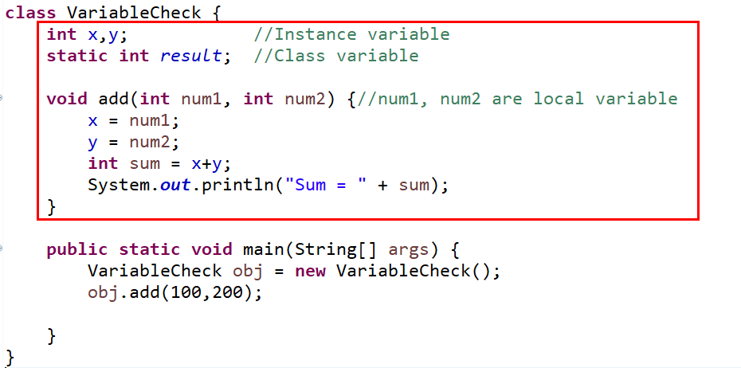
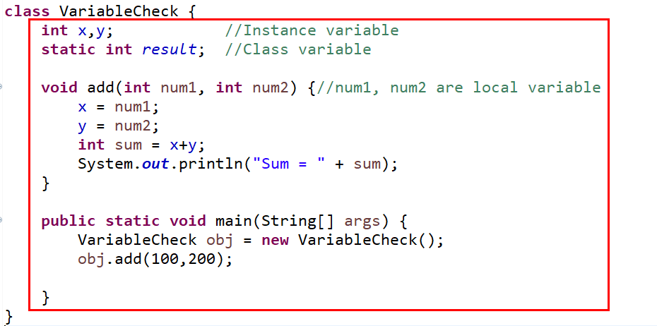
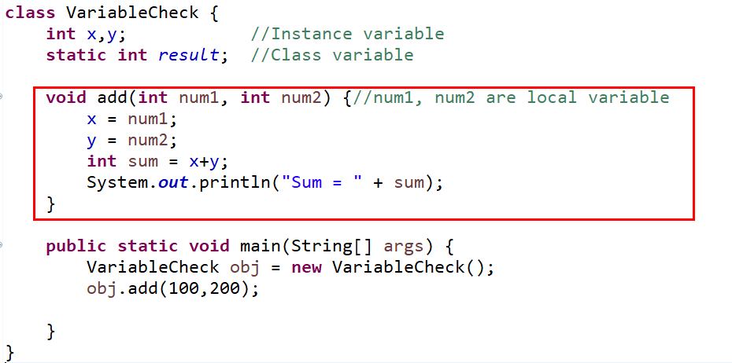

목표
=======
자바의 프리미티브 타입, 변수 그리고 배열을 사용하는 방법을 익힙니다.

학습할 것
=======

* 프리미티브 타입 종류와 값의 범위 그리고 기본 값
* 프리미티브 타입과 레퍼런스 타입
* 리터럴
* 변수 선언 및 초기화하는 방법
* 변수의 스코프와 라이프타임
* 타입 변환, 캐스팅 그리고 타입 프로모션
* 1차 및 2차 배열 선언하기
* 타입 추론, var

--------------------------------------------------------------
week2: 자바 데이터 타입, 변수 그리고 배열
=======
## 1. 프리미티브 타입 종류와 값의 범위 그리고 기본 값

| 종류 | 데이터형 | 크기byte(bit) | 기본값 | 표현 범위| 
| ------ | :------: | :------: | :------: | :------: |
|문자형 | `char` | 2byte(16bit) | ‘\u0000’|'\u0000' ~ 'uFFFF' (16비트 유니코드 문자 데이터)|
|정수형 | `byte` | 1byte(8bit) | 0 | -128 ~ 127|
|정수형 | `short` | 2byte(16bit) | 0 | -32768 ~ 32767|
|정수형 | `int` | 4byte(32bit) | 0 | -2147483648 ~ 2147483647( -21억 ~ + 21억)|
|정수형 | `long` | 8byte(64bit) | 0 | -9223372036854775808 ~ 9223372036854775807(-100경 ~ + 100경)|
|실수형 | `float` | 4byte(32bit) | 0.0f | 1.4E-45 ~ 3.4028235E38|
|실수형 | `double` | 8byte(64bit) | 0.0d | 4.9E-324 ~ 1.7976931348623157E308|
|논리형 | `boolean` | 1byte(8bit) | false | true 또는 false|   
   
      
## 2. 프리미티브 타입과 레퍼런스 타입
자바에는 데이터 타입에 크게 두 가지 `프리미티브 타입(원시타입,Primitive Type)`과 `레퍼런스 타입(참조타입,Reference Type)`이 있다.   
`프리미티브 타입`은 정수, 실수, 문자, 논리 리터럴 등의 **실제 데이터 값을 저장하는 타입**이고,    
`레퍼런스 타입`은 객체(Object)의 번지를 참조(주소를 저장)하는 타입으로 **메모리 번지 값을 통해 객체를 참조하는 타입**이다.
   
      
## 3. 리터럴
**`리터럴(literal)`은 프로그램에서 직접 표현한 값**이다.   
종류로는 정수, 실수, 문자,논리, 문자열 리터럴이있다. 이 중 `문자열`은 기본타입이 아니다.
   
#### 정수형 리터럴
: 10진수, 8진수, 16진수, 2진수 리터럴이 존재한다.   
정수 리터럴은 int형으로 컴파일되며, long타입 리터럴은 술자 뒤에 `L`이나 `l`을 붙여 표시한다.
- 15 -> 10진수 리터럴 15
- **0**15->0으로 시작하면 8진수, 십진수값으로 13출력
- **0x**15->0x로 시작하면 16진수, 십진수값으로 21출력
- **0b**b0101 ->0b로 시작하면 2진수, 십진수값으로 5출력
   
#### 실수 리터럴
소수점 형태나 지수 형태로 표현한 값이다. 실수 타입 리터럴은 double타입으로 컴파일 된다.
숫자 뒤에 f(float)나 d(double)을 명시적으로 붙이기도 한다.
(float은 f를 꼭 붙여줘야하고, double은 생략가능하다)
   
#### 문자 리터럴
단일 인용부호('')로 문자를 표현한다.
| 특수문자 리터럴 | 의미 |
|:-----:|:-------:|
| '\b' | 백스페이스(backspace) |
| '\t' | 탭(tab) |
| '\n' | 라인피드(line feed) |
| '\f' | 폼피드(form feed) |
| '\r' | 캐리지 리턴(carriage return) |
| '\"' | 이중 인용부호(double quote) |
| '\' | 단일 인용부호(single quote) |
| '\\' | 백슬래시(backlash) |
   
#### 문자열 리터럴
문자열은 기본타입이 아니다. ("")로 문자를 표현한다.
```java
String lter = "JAVA";
lter = lter + 26;
System.out.print(lter); // JAVA26 출력
```
   
#### 논리 타입 리터럴, 외 리터럴
boolean 타입 변수에 치환하거나 조건문에 이용한다.
```java
boolean flag = false;
System.out.print(flag); // false
System.out.print(!flag); //true
```
null리터럴은 레퍼런스에 대입해서 사용한다.
기본타입에는 사용이 불가능하고 String같은 경우에 사용가능하다.
```java
int num = null; //에러 
String str = null;
str = "JAVA";
```
   
     
## 4. 변수 선언 및 초기화하는 방법
변수를 사용하기 전에 저장하고자 하는 데이터종류나 크기에 따라 반드시 `자료형(Data Type)`을 붙여서 선언하여야 한다.    
식별자 이름을 변수 명명규칙을 지키면서 선언해 주어야 한다.
   
#### 변수 명명규칙
- 첫번째 글자는 문자이거나 '$', '_' 이어야 하고 숫자로 시작할 수 없다(필수)
- 영어 대소문자가 구분된다(필수)
- 첫 문자는 영어 소문자로 시작하되, 다른 단어가 붙을 경우 첫 문자를 대문자로 한다(관례)
- 문자 수(길이)의 제한은 없다.
- 자바 예약어는 사용할 수 없다(필수)
```java
 int score;    //변수 선언
 score = 100;  //값 저장
 ```
   
     
## 5. 변수의 스코프와 라이프타임
변수(variable)의 스코프란 변수에 접근하거나 접근할 수 있는 유효 범위/영역을 말한다.
일반적인 규칙은 변수가 선언된 블록 내에서만 액세스 할 수 있다.
블록은 왼쪽 중괄호 `{`로 시작하고 오른쪽 중괄호`}`로 끝난다.

변수의 라이프 타임(LifeTime)이란 변수가 메모리에 살아있는 기간을 말한다.
   
#### Instance Variables
> **정의**   
> 클래스 내부와 모든 메소드 및 블록 외부에서 선언된 변수   
> **scope**   
> 정적 메서드를 제외한 클래스 전체    
> **라이프 타임**   
> 객체가 메모리에 남아있을 때 까지   
> **예**   
> x와 y의 scope   
</img><br/>

   
#### Class Variables
> **정의**   
> 클래스 내부와 모든 블록 외부에서 선언되고, static으로 표시도니 변수   
> **scope**   
> 클래스 전체   
> **라이프 타임**   
> 프로그램이 끝날 때까지 또는 클래스가 메모리에 로드 되는 동안   
> **예**   
> result(class variable)의 scope   
</img><br/>
   
#### Instance Variables
> **정의**   
> 인스턴스 및 클래스 변수가 아닌 모든 변수   
> **scope**   
> 선언된 블록 내에 있음   
> **라이프 타임**   
> 컨트롤이 선언 된 블록을 떠날때 까지   
> **예**   
> a,b(local variable)의 scope   
</img><br/>
   
     
## 6. 타입 변환, 캐스팅 그리고 타입 프로모션
타입 변환이란 데이터 타입을 다른 데이터 타입으로 변환하는 것을 말한다. 타입 변환에는 두 가지 종류가 있다.    
하나는 `자동(묵시적)타입 변환(Promotion)`이고 다른 하나는 `강제(명시적)타입(Casting) 변환`이다.
   
#### 프로모션(Promotion)
Promotion(자동 타입변환)은 프로그램 실행 도중에 자동적으로 타입 변환이 일어나는 것을 말한다.   
자동 타입변환은 작은 크기를 가지는 타입이 큰 크기를 가지는 타입에 저장될 때 발생한다.   
자동 타입 변환에서 단 하나의 예외가 있는데,   
char는 2byte의 크기를 가지지만, char의 범위는 0 ~ 65535이므로 음수가 저장될 수 없다.   
따라서 음수가 저장될 수 있는 byte타입(1byte)을 char타입으로 자동 변환시킬 수 없다.   
```java
byte byteValue = 65;
char charValue = byteValue;        // (x) 컴파일 에러
char charValue = (char)byteValue;  //(o) 강제 타입변환(casting)으로 가능
```
   
#### 캐스팅(Casting)
강제적으로 큰 데이터 타입을 작은 데이터 타입으로 쪼개어서 저장하는것을 Casting)(강제 타입 변환)이라고한다.       
강제 타입 변환은 캐스팅 연산자 <code>()</code>를 사용한는데, 괄호 안에 들어가는 타입은 쪼개는 단위이다.   

Casting을 하기 전에는 우선 안전하게 값이 보존될 수 있는지 검사하는 것이 좋다.   
어떠한 타입으로 변환하기 전에 변환될 값이 해당 타입으로 변환된 후에도 값의 손실이 발생하지 않는지 검사해서 올바른 타입 변환이 되도록 한다.
```java
/* int형 값을 byte로 변경하기 전 검사하는 방법 */
class CastingSample {
	public static void main(String[] args) 
	{
		int intValue =128;
		if ((i<Byte.MIN_VALUE) || (i>Byte.MAX_VALUE)) {
			System.out.print("It can't be changed to ByteType!");
		} else {
			byte bValue = (byte)intValue;
			System.out.println("Casting Result = "+ bValue);
		}
	}
}
```
   
     
## 7. 1차 및 2차 배열 선언하기
배열을 사용하기 위해서는 우선 배열 변수를 선언해야하며, 아래와 같이 두 가지 형태로 작성할 수 있다.
```
타입[] 변수;
타입 변수[];
```
배열 변수는 참조 변수에 속한다. 배열도 객체이므로 힙영역(Heap Area)에 생성되고 배열 변수는  힙영역의 배열 객체를 참조하게 된다.     
참조할 배열 객체가 없다면 배열 변수는 null값으로 초기화 될 수 있다.
```java
int[] arr1 = null;
//값 목록들이 나중에 결정될 땐, new연산자를 사용해서 값 목록을 지정해야한다.
arr1 = new int[] {0,1}; 
		
int[] arr2 = new int[] {0,1};
		
int[] arr3 = new int[2];
arr3[0] = 0;
arr3[1] = 1;
```
   
#### 1차 배열 선언하기
```java
int[] PrimaryArr = new int[2];
PrimaryArr[0] = 0;
PrimaryArr[1] = 1;
for (int i=0; i< PrimaryArr.length;i++) {
    System.out.print(PrimaryArr[i] + " ");
}
```
> 0 1
   
#### 2차 배열 선언하기
```java
int[][] QuadraticArr = new int[2][3];
QuadraticArr[0][0]=0;
QuadraticArr[0][1]=1;
QuadraticArr[0][2]=2;
QuadraticArr[1][0]=3;
QuadraticArr[1][1]=4;
QuadraticArr[1][2]=5;
		
for (int i=0; i< QuadraticArr.length;i++) {
    for(int j=0; j<QuadraticArr[i].length; j++) {
        System.out.print(QuadraticArr[i][j] + " ");
    }
}
```
> 0 1 2 3 4 5 
   
     
## 8. 타입 추론, var
타입 추론이란, 말 그대로 개발자가 변수의 타입을 명시적으로 적어주지 않고도, 컴파일러가 알아서 이 변수의 타입을 대입된 리터럴로 추론하는 것이다.
var는 초기화 값이 있는 지역변수로만 선언이 가능하다.
멤버변수, 또는 메소드의 파라미터, 리턴 타입으로는 사용이 불가능하다.
   
**var의 잘못된 사용법**
- Var는 `초기화` 없이 사용할 수 없다.
- Var타입 변수에는 `null`값이 들어갈 수 없다.
- Var타입은 `로컬 변수`에만 선언이 가능하다.
- `Lambda Expression`에는 `명시적인 타입`을 지정해줘야 한다.
- 배열을 선언할 때, `var` 대신 타입을 명시해줘야 한다.
